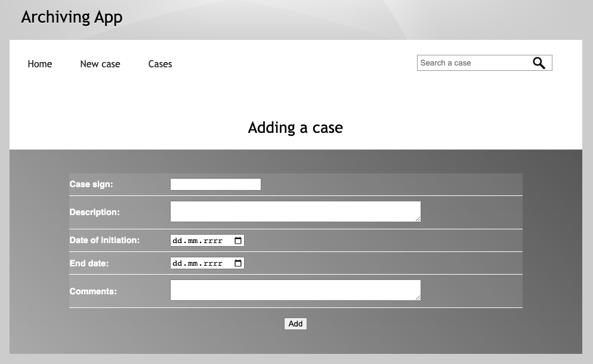
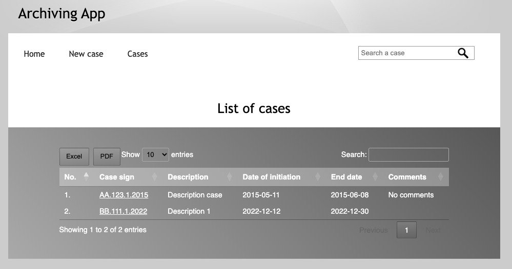
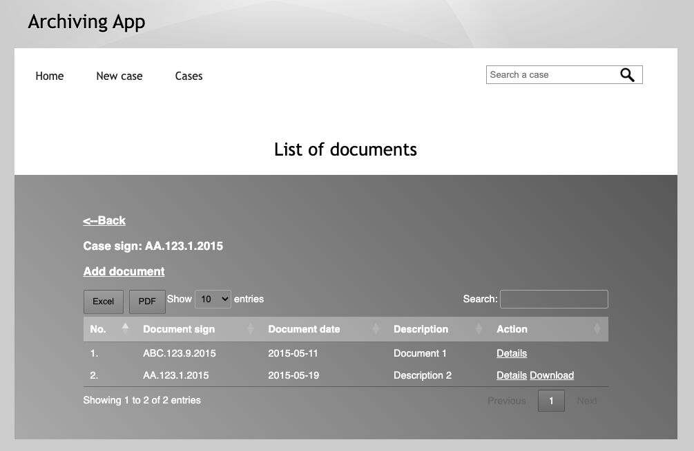
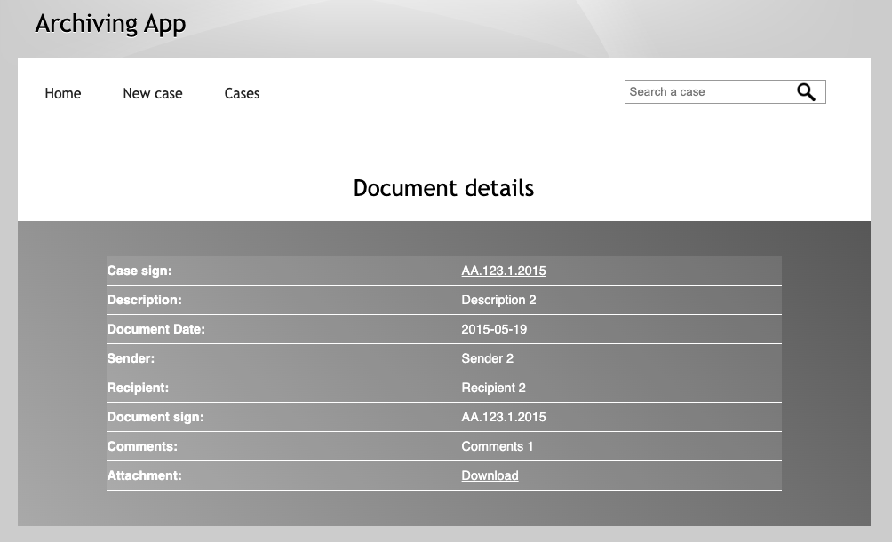

# ArchivingApp
## An application for archiving paper documents

The project is designed to store scans and descriptions of documents 
in a database and enable quick search and viewing of archived documents.

## Features:
- Creating case
- Adding documents to case
- Adding and downloading files
- Searching by case sign
- Sorting tables
- Documents details
- Exporting tables to pdf or excel

## Tech:

DataTables
## Installation: 

1. Create database: "archives" 
Write in Query console: 
`CREATE DATABASE archives` 
   `CHARACTER SET utf8mb4` 
   `COLLATE utf8mb4_unicode_ci;` 
2. In application.properties:
   1. complete username
   2. complete password

## ScreenShots:

